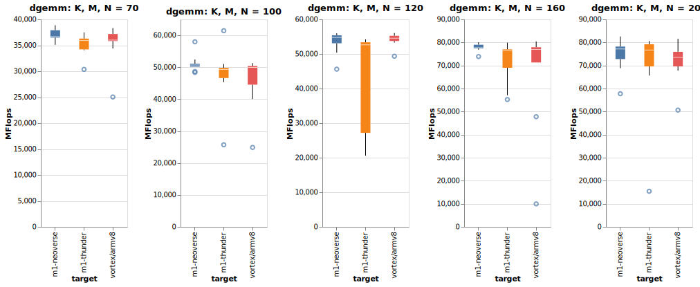

# Benchmarking OpenBLAS on an Apple MacBook M1
All tests were run on an Apple MacBook Pro 13 M1 w/ 16GB RAM. 

In order to compile the official OpenBLAS benchmarks using Xcode / clang version 12.0.0, you will need to have native homebrew for the M1 and install gfortran. Modify the Makefile as follows, where `-L` points to your homebrew `lib` path:
```
smallscaling: smallscaling.c ../$(LIBNAME)
        $(CC) $(CFLAGS) -o $(@F) $^ $(EXTRALIB) -Xpreprocessor -fopenmp -lomp -lm -lpthread -L /opt/homebrew/lib/
```

## Benchmarking `dgemm`
Comparing the performance of `dgemm` provided by:
- the MacOS vecLib framework
- OpenBLAS's VORTEX/ARMv8 kernel (the default on the M1)
- and OpenBLAS's NEOVERSEN1 and THUNDERX3T110 kernels.

Each test consisted of 10 runs with the first run being discarded. `OPENBLAS_LOOPS` was set to 20 in order to avoid an underflow condition (see https://github.com/xianyi/OpenBLAS/issues/2814#issuecomment-752682281). 

Raw data is in the _dgemm_ folder.

### OpenBLAS (with VORTEX/ ARMV8 kernel) vs Veclib
vecLib significantly outperforms OpenBLAS, likely as it is using the M1's hardware-based matrix multiplication acceleration.


### OpenBLAS VORTEX/ ARMV8 vs NEOVERSEN1 vs THUNDERX3T110 kernels
All tests run on the M1. Only the kernels have been changed. A little difficult to differences see given the similarity in results and scale. See charts below for some interesting matrix dimension test results.




The NEOVERSEN1 kernel appears to offer better results for the M1 than the default ARMV8 kernel.


