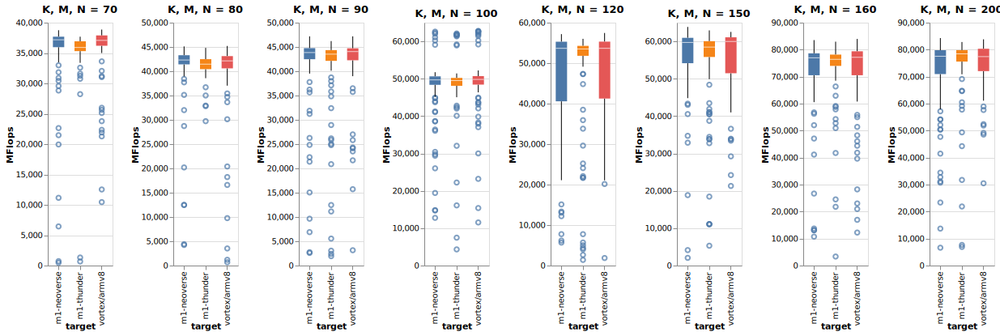

Update 12/31/2020: Added MKL and OpenBLAS ZEN kernel results run on an AMD Ryzen 9 3900XT. Reran tests with 100 iterations.

# Benchmarking OpenBLAS on an Apple MacBook M1
All vecLib and VORTEX tests were run on an Apple MacBook Pro 13 M1 w/ 16GB RAM. MKL and ZEN results run on an AMD Ryzen 9 3900XT desktop-class CPU.

In order to compile the official OpenBLAS benchmarks using Xcode / clang version 12.0.0, you will need to have native homebrew for the M1 and install gfortran. Modify the Makefile as follows, where `-L` points to your homebrew `lib` path:
```
smallscaling: smallscaling.c ../$(LIBNAME)
        $(CC) $(CFLAGS) -o $(@F) $^ $(EXTRALIB) -Xpreprocessor -fopenmp -lomp -lm -lpthread -L /opt/homebrew/lib/
```

## Benchmarking `dgemm`
Comparing the performance of `dgemm` provided by:
- the MacOS vecLib framework
- OpenBLAS's VORTEX/ARMv8 kernel (the default on the M1)
- OpenBLAS's NEOVERSEN1 and THUNDERX3T110 kernels.
- The Intel MKL and OpenBLAS ZEN kernel on an AMD Ryzen 9 3900XT @ 4GHz.

Each test consisted of 100 runs with the first run being discarded. `OPENBLAS_LOOPS` was set to 20 in order to avoid an underflow condition (see https://github.com/xianyi/OpenBLAS/issues/2814#issuecomment-752682281). 

In order to force the Intel MKL to use AVX intrinsics on the Ryzen, `MKL_DEBUG_CPU_TYPE=5` was set in the environment. 

Raw data is in the _dgemm_ folder.

### OpenBLAS (with VORTEX/ ARMV8 kernel) vs Veclib vs MKL vs OpenBLAS (ZEN kernel)
#### vecLib is extraordinarily fast. The OpenBLAS on the M1 holds its own versus the desktop Ryzen 9.
With large matrices, MKL on the Ryzen significantly outperforms vecLib on the M1. However, vecLib bests the MKL on smaller matrices, often by a wide margin. Very impressive given that the M1 is a low-power mobile part. 

vecLib significantly outperforms OpenBLAS, likely as it is using the M1's hardware-based matrix multiplication acceleration. It's very interesting to see how close the OpenBLAS ZEN kernel on the Ryzen is to the M1's OpenBLAS VORTEX results.  

Displaying median and shaded IQR.


### OpenBLAS VORTEX/ ARMV8 vs NEOVERSEN1 vs THUNDERX3T110 kernels
All tests run on the M1. Only the kernels have been changed. A little difficult to differences see given the similarity in results and scale. See charts below for some interesting matrix dimension test results.

Displaying median and shaded IQR.




The NEOVERSEN1 kernel appears to offer better results for the M1 than the default ARMV8 kernel.

### Other tests
The results.* folders contain various test runs for the full benchmark suite. They suffered from an underflow issue and should be disregarded. See above regarding underflows.


